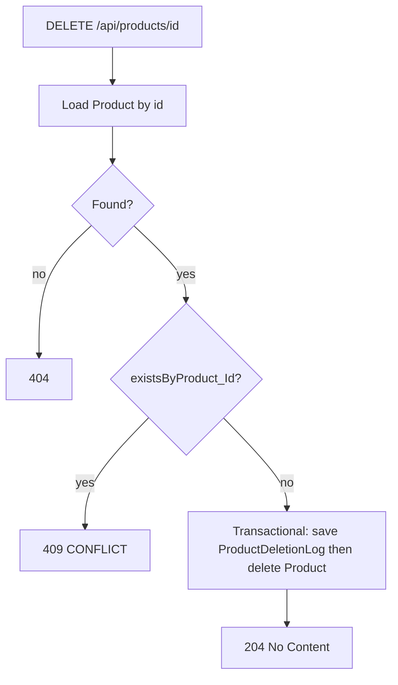

# CAT-US3 & CAT-US4 — Implementation Plan

## Overview

Add ADMIN-only PUT/DELETE for products with validation (immutable `productCode`, price > 0, availability ≥ 0), hard-delete only when no `order_items` reference the product (else 409), persist `ProductDeletionLog` with actor snapshot in one transaction, and wire the React catalogue with edit + Yes/No delete modal plus tests and doc touch-ups—without implementing CAT-US5+.

## Scope boundary

- **In scope:** Product update/removal APIs, audit log for deletion, admin UI (confirm delete + edit), tests in `backend/src/test/java/com/ipos/cat/CatalogueCatTest.java`, factual updates to `CATprogress.txt` and optionally one line in `README.md`.
- **Explicitly out of scope:** CAT-US5–US10 (search, merchant masking, stock delivery, min threshold, reporting), ORD listing fixes, ACC/RPRT. No merchant-side hiding of discontinued products unless you add a `discontinued` flag later (not part of this plan).

---

## 1. CAT-US3 — Checklist (traceability)

| Acceptance criterion | Implementation |
|---------------------|----------------|
| **Yes/No confirmation before delete** | `frontend/src/Catalogue.jsx`: ADMIN-only **Delete** opens a small **modal** with **Yes** / **No**; call `deleteProduct(id)` only on **Yes**. Prefer modal over `window.confirm` (prototype-only if using `confirm`). |
| **Log deletion including which user** | New table/entity **`ProductDeletionLog`** (mirror `StandingChangeLog`): snapshot `productId` (Long), `productCode` (String), `description` (String), **`deletedBy`** → `User` FK, `deletedAt` (`Instant`). `ProductDeletionLogRepository` + insert in same transaction as delete (see §3). |
| **API** | `DELETE /api/products/{id}` on `ProductController` → `ProductService.deleteProduct(Long id, User deletedBy)`. |
| **Transaction boundary** | Single `@Transactional` method: load product → **guard** (§3) → **save log** → **delete product**. Roll back entirely on failure. |

---

## 2. CAT-US4 — Checklist (traceability)

| Acceptance criterion | Implementation |
|---------------------|----------------|
| **Cannot change existing Product ID (`productCode`)** | **`UpdateProductRequest` has no `productCode` field.** Path variable **`id`** (surrogate PK) is the only identifier. Service loads `Product` by `id` and updates **only** `description`, `price`, `availabilityCount` — never `setProductCode`. |
| **Price / availability validation** | Align with **CAT-US2** in `CreateProductRequest`: **price:** `@NotNull` + `@DecimalMin(value = "0.01", inclusive = true)` → **strictly > 0**. **availability:** `@NotNull` + `@Min(0)` → **≥ 0**. (Story text says “non-negative”; business rule for price is **> 0** to match create.) |
| **PUT contract** | `PUT /api/products/{id}` with JSON body matching `UpdateProductRequest` — **full replacement of the three fields** (simplest contract; no PATCH). |

**Pseudocode (service):**

```text
updateProduct(id, dto):
  product = repo.findById(id) or throw 404
  product.setDescription(trim(dto.description))
  product.setPrice(dto.price)
  product.setAvailabilityCount(dto.availabilityCount)
  return repo.save(product)
```

---

## 3. Delete policy (required decision)

**Facts:** `OrderItem` has `@ManyToOne` → `product_id` FK to `products.id`. Line items already snapshot `unitPriceAtOrder`; the product row is still referenced for joins/history.

**Decision:** **Hard delete only when there are zero referencing `order_items`.** Otherwise return **409 CONFLICT** with a clear message (e.g. cannot delete product with order history).

- **Why not unconditional hard delete:** MySQL FK will reject delete when child rows exist; even with optional FK, deleting would harm historical integrity.
- **Why not soft delete in this slice:** Avoids CAT-US6 “hide from merchant” / listing changes; can be a follow-up if product owners want “discontinued” without 409.

**Enforcement:** Add to `OrderItemRepository`:

```java
boolean existsByProduct_Id(Long productId);
```

**Flow:**



---

## 4. HTTP error mapping

| Situation | Status | Notes |
|-----------|--------|--------|
| Bean validation (`UpdateProductRequest`) | **400** | Spring MVC default for `@Valid` failures |
| Product id not found | **404** | Use `ResponseStatusException(HttpStatus.NOT_FOUND, ...)` — consider aligning `ProductService.findById` (currently `RuntimeException`) when implementing update/delete paths |
| Delete blocked: order line items exist | **409** | CONFLICT |
| Authenticated non-ADMIN | **403** | Already blocked by `SecurityConfig` (`PUT`/`DELETE` `/api/products/**` → `hasRole("ADMIN")`) |
| Success update | **200** + JSON `Product` | |
| Success delete | **204** No Content | Optional **200** with empty body — prefer **204** for DELETE |

**Actor resolution for audit (same pattern as `OrderController`):** In `ProductController`, `Authentication auth = SecurityContextHolder.getContext().getAuthentication();` then `userRepository.findByUsername(auth.getName())` → pass `User` into `deleteProduct`. If missing user row → **500** or **401** (treat as programming error; mirror existing controller style).

---

## 5. Backend file-level tasks

| File | Task |
|------|------|
| **New** `ProductDeletionLog.java` | Table e.g. `product_deletion_logs`: id, `product_id_snapshot` (Long, not FK), `product_code_snapshot`, `description_snapshot`, `deleted_by_user_id` (FK `users`), `deleted_at`. Mirror column naming style from `StandingChangeLog`. |
| **New** `ProductDeletionLogRepository.java` | `JpaRepository<ProductDeletionLog, Long>`. |
| **New** `UpdateProductRequest.java` | Fields: `description` (`@NotBlank`), `price` (`@NotNull`, `@DecimalMin("0.01")`), `availabilityCount` (`@NotNull`, `@Min(0)`). **No** `productCode`. |
| `OrderItemRepository.java` | Add `existsByProduct_Id(Long productId)`. |
| `ProductService.java` | Inject `OrderItemRepository`, `ProductDeletionLogRepository`. Add `updateProduct(Long id, UpdateProductRequest req)` and `deleteProduct(Long id, User deletedBy)` with guards and `ResponseStatusException` for 404/409. |
| `ProductController.java` | Inject `UserRepository`. Add `@PutMapping("/{id}")`, `@DeleteMapping("/{id}")` with `@PathVariable Long id`, `@Valid` body on PUT, resolve `User` for DELETE. |
| `SecurityConfig.java` | **Verify only** — lines 302–305 already allow GET authenticated, POST/PUT/DELETE ADMIN for `/api/products/**`; no change unless a test reveals a gap. |

**Dependency note:** No cross-package dependency on CAT-US5+; only existing order/catalogue entities.

---

## 6. Frontend file-level tasks

| File | Task |
|------|------|
| `frontend/src/api.js` | `updateProduct(id, body)` → `PUT /api/products/${id}` with `description`, `price`, `availabilityCount`; `deleteProduct(id)` → `DELETE`; reuse `parseResponseBody` / `errorMessageFromBody` like `createProduct`. |
| `frontend/src/Catalogue.jsx` | ADMIN table: **Edit** opens modal (or inline) prefilled from row; submit → `updateProduct`. **Delete** → confirm modal **Yes**/**No** → `deleteProduct`; refresh list; surface API errors. |

---

## 7. Tests & docs

| Artifact | Task |
|----------|------|
| `CatalogueCatTest.java` | **Unit (Mockito):** `updateProduct` — 404 when missing; success path mutates fields; **never** changes `productCode`. `deleteProduct` — 404; 409 when `existsByProduct_Id` true; success saves log + deletes when false. Update reflective `ProductService` construction in `@BeforeEach` for new constructor deps. **WebMvc:** PUT invalid body → 400; PUT happy path → 200; DELETE → 204 (mock service). |
| `CATprogress.txt` | Flip CAT-US3/US4 STATUS to done; shorten “WORK TO COMPLETE” to reflect shipped behavior. |
| `README.md` | One line: e.g. `PUT/DELETE /api/products/{id}` (ADMIN) and deletion log — if not already documented. |

---

## 8. Ordered implementation sequence

1. **Entity + repository:** `ProductDeletionLog` + `ProductDeletionLogRepository`; `OrderItemRepository.existsByProduct_Id`.
2. **DTO:** `UpdateProductRequest`.
3. **Service:** `updateProduct`, `deleteProduct` (transactional delete + log); standardize not-found to **404** on these paths.
4. **Controller:** PUT/DELETE + `User` resolution for delete.
5. **Frontend:** `api.js` then `Catalogue.jsx` UX.
6. **Tests:** extend `CatalogueCatTest` + `ProductControllerCatalogueCatWebMvcTest`.
7. **Docs:** `CATprogress.txt`, optional `README.md` line.

---

## 9. Unavoidable dependencies

None from CAT-US5–US10. The only coupling is existing **`order_items.product_id`** FK, which drives the **409** rule above.

---

## Implementation todos (tracking)

1. Add `ProductDeletionLog` + `ProductDeletionLogRepository`; `OrderItemRepository.existsByProduct_Id`
2. Add `UpdateProductRequest`; extend `ProductService` with `updateProduct` + transactional `deleteProduct` (log + delete, 404/409)
3. `ProductController` PUT/DELETE + `UserRepository` for `deletedBy`
4. `api.js` `updateProduct`/`deleteProduct`; `Catalogue.jsx` edit UI + delete Yes/No modal
5. Extend `CatalogueCatTest` + WebMvc tests; update `CATprogress.txt` and `README` if needed
