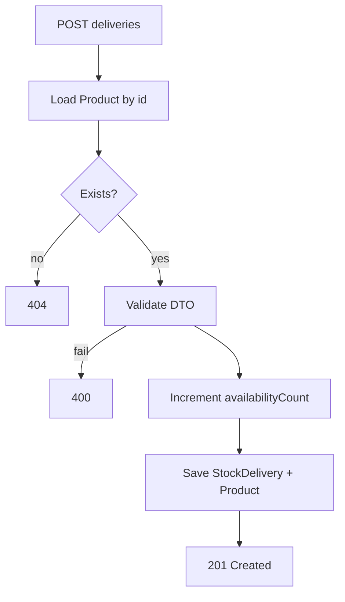

# CAT-US7 & CAT-US8 — Implementation Plan (executor-ready)

## Purpose of this document

This plan is written so an implementer (e.g. Claude Code) can ship **CAT-US7 (Stock Delivery Recording)** and **CAT-US8 (Minimum Stock Thresholds)** without re-reading the full epic. It mirrors the structure of [`CAT_US34plan.md`](CAT_US34plan.md) and the CAT-US5/US6 plan: traceability tables, API semantics, JPA/Spring annotations, HTTP behaviour, security, frontend wiring, tests, and documentation updates.

**Primary acceptance sources:** [`CATprogress.txt`](CATprogress.txt) sections “CAT-US7 — Stock Delivery Recording” and “CAT-US8 — Minimum Stock Thresholds” (lines ~400–471 in a typical snapshot). If `CATprogress.txt` diverges, treat it as the backlog truth for wording; this plan adds engineering decisions.

---

## 0. Acceptance criteria audit (full traceability to `CATprogress.txt`)

Use this table to verify nothing is missed before merge.

### CAT-US7 — Stock Delivery Recording

| # | Verbatim acceptance (`CATprogress.txt`) | Satisfied by (this plan) |
|---|----------------------------------------|---------------------------|
| Title | Administrator records new stock deliveries; inventory levels **automatically** increased | `POST .../deliveries` + transactional increment of `availabilityCount` (§3, §7). |
| AC1 | “Record the **delivery date** and the **quantity received**.” | `StockDelivery` entity: `deliveryDate` + `quantityReceived`; optional supplier ref; **`recordedBy` → `User`** (same intent as backlog **createdBy**—see §3a). |
| AC2 | “Automatically **increment** the **Availability** of the product by the **delivery quantity**.” | `ProductService.recordStockDelivery`: load `Product`, add quantity to `availabilityCount`, save product + delivery in **one `@Transactional`** (§3). |
| AC3 | “Reject any delivery quantity **equal to or less than zero**.” | `RecordStockDeliveryRequest.quantityReceived`: `@NotNull` + `@Min(1)` (§3). Controller `@Valid` → **400**. |
| Backlog NOTE | No delivery workflow today | Addressed by new API + entity + UI (§7). |

### CAT-US8 — Minimum Stock Thresholds

| # | Verbatim acceptance (`CATprogress.txt`) | Satisfied by (this plan) |
|---|----------------------------------------|---------------------------|
| Title | Administrator sets **minimum stock thresholds** **per item** so the system **can flag** low stock later | `Product.minStockThreshold` per product row; **US9 UI flagging** is out of scope but data must exist (§12). |
| AC1 | “Allow a specific minimum stock threshold … **assigned to each unique Product ID**.” | One threshold per `Product` (unique catalogue row / business `productCode`); column `min_stock_threshold`; **create + update DTOs** + **admin UI** (§4, §4b). |
| AC2 | “Validate that threshold values are **not negative**.” | `@Min(0)` on DTO field when present (§4). |

### Cross-story dependencies

| Dependency | Requirement |
|------------|-------------|
| US8 before US7 (engineering) | [`CATprogress.txt`](CATprogress.txt) §5 suggests **US8 then US7**—schema/DTOs stable before delivery workflow. |
| US9 later | US8 stores threshold; **do not** implement US9 warnings in this slice (§12). |

---

## Essential context files (read before coding)

| File | Why |
|------|-----|
| [`CATprogress.txt`](CATprogress.txt) | Official story text, acceptance criteria, suggested implementation order (US8 before US7 in engineering order—see §Scope). |
| [`CLAUDE.md`](CLAUDE.md) | Project commands, architecture, SecurityConfig as RBAC source of truth, frontend `rbac.js` / `api.js` patterns. |
| [`backend/src/main/java/com/ipos/entity/Product.java`](backend/src/main/java/com/ipos/entity/Product.java) | Add `minStockThreshold`; `availabilityCount` is decremented in orders. |
| [`backend/src/main/java/com/ipos/service/ProductService.java`](backend/src/main/java/com/ipos/service/ProductService.java) | Extend with delivery recording + threshold on create/update. |
| [`backend/src/main/java/com/ipos/controller/ProductController.java`](backend/src/main/java/com/ipos/controller/ProductController.java) | New endpoint for deliveries; extend PUT/create bodies for threshold. |
| [`backend/src/main/java/com/ipos/security/SecurityConfig.java`](backend/src/main/java/com/ipos/security/SecurityConfig.java) | **POST** `/api/products/**` is **ADMIN** only—nested paths like `POST /api/products/{id}/deliveries` match this rule (verify after adding). |
| [`backend/src/main/java/com/ipos/dto/CreateProductRequest.java`](backend/src/main/java/com/ipos/dto/CreateProductRequest.java), [`UpdateProductRequest.java`](backend/src/main/java/com/ipos/dto/UpdateProductRequest.java) | Add optional/required `minStockThreshold` with Bean Validation. |
| [`backend/src/main/java/com/ipos/dto/CatalogueProductDto.java`](backend/src/main/java/com/ipos/dto/CatalogueProductDto.java) | Expose threshold in catalogue JSON where appropriate (merchants: optional omit or show read-only per policy in §CAT-US8). |
| [`backend/src/main/java/com/ipos/entity/ProductDeletionLog.java`](backend/src/main/java/com/ipos/entity/ProductDeletionLog.java) | Pattern for audit-style entities (FK to `User`, timestamps). |
| [`frontend/src/Catalogue.jsx`](frontend/src/Catalogue.jsx) | Admin forms for create/edit; add delivery UI + threshold fields. |
| [`frontend/src/api.js`](frontend/src/api.js) | New `recordDelivery(productId, body)` (or similar). |
| [`backend/src/test/java/com/ipos/cat/CatalogueCatTest.java`](backend/src/test/java/com/ipos/cat/CatalogueCatTest.java) | Extend with US7/US8 unit + WebMvc tests; **update `ProductService` constructor** in `@BeforeEach` when adding `StockDeliveryRepository` (§8). |
| [`backend/src/main/java/com/ipos/service/OrderService.java`](backend/src/main/java/com/ipos/service/OrderService.java) | **Read-only context:** stock **decrements** on order placement—do not change for US7/US8; deliveries **add** stock independently. |
| [`backend/src/main/resources/application.properties`](backend/src/main/resources/application.properties) | `spring.jpa.hibernate.ddl-auto` for dev schema; confirm new columns appear for `products` / `stock_deliveries`. |
| [`RBAC.md`](RBAC.md) (project root) | Optional: one line that **POST** stock deliveries is **ADMIN** only (same as product mutations). |

---

## Coding and documentation standards (mandatory)

The codebase uses **heavy, structured file headers** on many Java files (the `╔══╗` “WHAT / WHY / HOW TO EXTEND” blocks). New types should follow the same style:

- **Entities** (`StockDelivery`, changes to `Product`): full box header + field-level comments where non-obvious.
- **DTOs**: Javadoc on class purpose; Bean Validation annotations with **explicit `message = "..."`** (match [`CreateProductRequest`](backend/src/main/java/com/ipos/dto/CreateProductRequest.java)).
- **Services**: Javadoc on public methods that mutate state or enforce business rules; `@Transactional` on write paths.
- **Controllers**: Update the existing header block in [`ProductController`](backend/src/main/java/com/ipos/controller/ProductController.java) to list new routes.
- **Frontend**: Match comment style in [`Catalogue.jsx`](frontend/src/Catalogue.jsx) / [`api.js`](frontend/src/api.js) (section dividers, short WHAT/WHY where helpful).

Do **not** strip existing comments to “save space.”

---

## Scope boundary

**In scope**

- **CAT-US7:** Persist stock deliveries (date + quantity + actor); reject quantity ≤ 0; **atomically** increment `Product.availabilityCount` in the same transaction as persisting the delivery row.
- **CAT-US8:** Per-product **minimum stock threshold**; validate non-negative; persist on `Product`; surface on create/update DTOs and admin UI; include in catalogue DTOs as needed for future US9 (optional: do not implement US9 UI in this slice unless explicitly requested).

**Explicitly out of scope**

- **CAT-US9** (automated low-stock UI warnings / banners).
- **CAT-US10** (low-stock report in RPRT / `ReportingPlaceholder.jsx`).
- Changing **OrderService** order-placement rules beyond what is needed for consistency (deliveries only add stock).
- Email/notifications, supplier master data beyond an optional string on `StockDelivery`.

**Engineering order (from [`CATprogress.txt`](CATprogress.txt) §5):** Implement **US8 first** (schema + DTOs + validation), then **US7** (delivery entity + API + increment). That avoids migrations that forget the threshold column before deliveries go live.

---

## 1. CAT-US7 — Checklist (traceability)

| Acceptance criterion | Implementation |
|---------------------|----------------|
| Record **delivery date** and **quantity received** | New entity **`StockDelivery`** (table e.g. `stock_deliveries`): `id`, `@ManyToOne` **`Product`**, `deliveryDate` (**`LocalDate`** recommended for “date-only” semantics), `quantityReceived` (**`int`**), **`recordedBy`** → `User` FK, **`recordedAt`** `Instant` default now. Optional: `supplierReference` `String` nullable. |
| **Automatically increment** product availability | Single `@Transactional` service method: load `Product` by id → `setAvailabilityCount(current + qty)` → save `StockDelivery` + save `Product` (order: persist delivery after updating product or save product once at end—see §3). |
| Reject delivery quantity **≤ 0** | Request DTO field **`quantityReceived`** with **`@Min(1)`** (strictly positive). Story: “equal to or less than zero” → `@Min(1)` satisfies “reject ≤ 0”. |

---

## 2. CAT-US8 — Checklist (traceability)

| Acceptance criterion | Implementation |
|---------------------|----------------|
| Threshold **per unique Product** | Add **`minStockThreshold`** on [`Product`](backend/src/main/java/com/ipos/entity/Product.java): `@Column(name = "min_stock_threshold")` **`Integer`**. Semantics: **`null`** = no threshold configured; **`0`** = threshold at zero (always “at or below” if stock is 0—useful for US9 later). Alternatively default `0` in DB—**decision:** prefer **nullable** to mean “not set” unless product owner wants default 0 everywhere. Document choice in entity Javadoc. |
| Validate **not negative** | DTOs: **`@Min(0)`** on `minStockThreshold` when non-null; or use **`@NotNull`** with default 0 if you require a number always—**recommended:** `@Min(0)` + allow null on create (optional field). |
| Expose on **create/update** | Extend **`CreateProductRequest`** and **`UpdateProductRequest`** with `Integer minStockThreshold` (optional getters/setters). Map in **`ProductService.createProduct`** / **`updateProduct`**. |
| Catalogue / API | Extend **`CatalogueProductDto.fromProduct`** to copy `minStockThreshold` for **ADMIN/MANAGER**; for **MERCHANT**, either **omit** (@JsonInclude) or show read-only—default: **omit** threshold for merchants unless PM wants visibility (CAT-US8 text says Administrator). |

---

## 3. CAT-US7 — API design

**Recommended endpoint (reuses existing security rule):**

```http
POST /api/products/{productId}/deliveries
Content-Type: application/json
```

**Authorization:** **ADMIN** only (matches [`SecurityConfig`](backend/src/main/java/com/ipos/security/SecurityConfig.java) `POST /api/products/**` → `hasRole("ADMIN")`).

**Request body DTO — e.g. `RecordStockDeliveryRequest`:**

| Field | Type | Validation |
|-------|------|------------|
| `deliveryDate` | `LocalDate` | `@NotNull` |
| `quantityReceived` | `Integer` | `@NotNull`, `@Min(1)` |
| `supplierReference` | `String` | optional, `@Size(max = 255)` if present |

**Response:** **201 Created** with JSON body of `StockDeliveryResponse` DTO (id, productId, deliveryDate, quantityReceived, recordedBy username/id, recordedAt) **or** **204 No Content** with `Location` header—prefer **201 + body** for simpler frontend.

**Errors:**

| Case | Status |
|------|--------|
| Validation failure | **400** (`@Valid`) |
| Product not found | **404** `ResponseStatusException` |
| Authenticated non-ADMIN | **403** (Spring Security) |

**Controller sketch:**

```java
@PostMapping("/{productId}/deliveries")
public ResponseEntity<StockDeliveryResponse> recordDelivery(
        @PathVariable Long productId,
        @Valid @RequestBody RecordStockDeliveryRequest request,
        Authentication authentication) {
    User recordedBy = userRepository.findByUsername(authentication.getName())
        .orElseThrow(() -> new ResponseStatusException(HttpStatus.INTERNAL_SERVER_ERROR, "..."));
    return ResponseEntity.status(HttpStatus.CREATED)
        .body(productService.recordStockDelivery(productId, request, recordedBy));
}
```

Place **`@PostMapping("/{productId}/deliveries")`** so it does **not** clash with `POST` on the collection root (`POST /api/products` creates product). Spring matches more specific paths; verify in tests.

**Service pseudocode:**

```text
recordStockDelivery(productId, dto, user):
  product = repo.findById(productId) or 404
  newCount = product.availabilityCount + dto.quantityReceived
  product.setAvailabilityCount(newCount)
  delivery = new StockDelivery(product, dto.deliveryDate, dto.quantityReceived, user, ...)
  deliveryRepo.save(delivery)  // cascade not required if FK set manually
  productRepo.save(product)
  return mapToResponse(delivery)
```

Use **one `@Transactional`** method wrapping both saves.

### 3a. Edge cases and integration details (do not skip)

| Topic | Rule |
|-------|------|
| **Backlog “createdBy”** | Map to **`recordedBy`** / `User` FK on `StockDelivery` (same pattern as [`ProductDeletionLog.deletedBy`](backend/src/main/java/com/ipos/entity/ProductDeletionLog.java)). Resolve actor via `UserRepository.findByUsername(authentication.getName())` in the controller, like delete. |
| **`availabilityCount` null** | If a legacy `Product` has `availabilityCount == null`, treat as **0** before adding delivery quantity: e.g. `int current = product.getAvailabilityCount() != null ? product.getAvailabilityCount() : 0;` |
| **JSON `LocalDate`** | Spring Boot parses ISO-8601 date strings (`yyyy-MM-dd`) into `LocalDate` in `@RequestBody`. Frontend: use `<input type="date">` or string in that format. |
| **Integer overflow** | Prototype: optional guard if `current + qty` would exceed `Integer.MAX_VALUE`; if skipped, document as known limitation. |
| **Legacy rows / new column (US8)** | Existing DB rows: `min_stock_threshold` **nullable**—backlog allows “nullable meaning no threshold”. Hibernate `ddl-auto=update` adds column without breaking existing data. |



---

## 4. CAT-US8 — Schema and DTO details

**`Product` entity additions:**

```java
@Column(name = "min_stock_threshold")
private Integer minStockThreshold;
```

- **Hibernate `ddl-auto=update`** (see [`application.properties`](backend/src/main/resources/application.properties)) will add the column in dev.
- **Getters/setters** + update constructor if used.

**`CreateProductRequest` / `UpdateProductRequest`:**

```java
@Min(value = 0, message = "Minimum stock threshold must not be negative")
private Integer minStockThreshold; // nullable = omit or clear threshold
```

**`ProductService`:** When creating/updating, copy `minStockThreshold` from DTO (allow null to clear threshold on update if desired).

**`CatalogueProductDto`:** Add `minStockThreshold` with `@JsonInclude(NON_NULL)` if omitting nulls; for merchants, consider `@JsonIgnore` on getter or branch in `fromProduct`—align with product owner (default: **ignore for MERCHANT** JSON).

**`POST`/`PUT` response bodies:** Today `create` / `update` return **`Product`** entity JSON. After adding `minStockThreshold` on `Product`, those responses **automatically** include the new field once the entity is saved—no extra DTO work unless you switch to a response DTO (out of minimal scope).

### 4b. CAT-US8 — Admin UI checklist (all required for AC1)

Backlog: “Expose on **create/update** DTOs **and admin UI**.” Implement **all** of:

1. **Add product** form ([`Catalogue.jsx`](frontend/src/Catalogue.jsx)): optional or required field **Minimum stock threshold** (number, ≥ 0), bound to `CreateProductRequest.minStockThreshold`.
2. **Edit product** modal: same field, bound to `UpdateProductRequest.minStockThreshold` (allow empty to **clear** threshold if backend accepts `null`).
3. **Catalogue table** (ADMIN): optional column **Min threshold** (or show only in edit modal—minimum is **(2)** + **(3)** visible somewhere for auditors).

After **record delivery** (US7), call the same **`loadProducts()`** / `getProducts()` refresh used elsewhere so stock counts update immediately.

---

## 5. Repository layer

| New / changed | Responsibility |
|---------------|------------------|
| **`StockDeliveryRepository`** | `JpaRepository<StockDelivery, Long>`; optional `List<StockDelivery> findByProduct_IdOrderByDeliveryDateDesc(Long id)` for future admin “delivery history” (optional stretch—out of minimal US7 if not in acceptance criteria). |

---

## 6. SecurityConfig

- **Preferred path:** `POST /api/products/{productId}/deliveries` — matches existing **`POST /api/products/**` → `ADMIN`** rule in [`SecurityConfig.java`](backend/src/main/java/com/ipos/security/SecurityConfig.java) (no new matcher required).
- **Alternative (from `CATprogress.txt`):** `POST /api/stock/deliveries` — **not** covered by `/api/products/**`; would require **new** `requestMatchers("/api/stock/**").hasRole("ADMIN")` (or equivalent) **plus** a separate controller. **Do not** use this alternative unless you explicitly add security rules; otherwise merchants could hit 403/404 inconsistently.
- **Verify** after implementation: **`MockMvc`** with `ROLE_MERCHANT` → **403** on POST deliveries; `ROLE_ADMIN` → **201**.
- Update the **comment block** in [`SecurityConfig.java`](backend/src/main/java/com/ipos/security/SecurityConfig.java) to mention stock delivery POST under products.

---

## 7. Frontend

| File | Task |
|------|------|
| [`api.js`](frontend/src/api.js) | `recordDelivery(productId, { deliveryDate, quantityReceived, supplierReference })` → `POST /api/products/${productId}/deliveries` with `fetchWithAuth`, **CSRF** on POST (same as [`createProduct`](frontend/src/api.js)). Use **`parseResponseBody`** / **`errorMessageFromBody`** on failure for consistent errors. |
| [`Catalogue.jsx`](frontend/src/Catalogue.jsx) | **ADMIN only:** “Record delivery” per row or modal (§4b); **after success** call `loadProducts()` / `getProducts()` so availability updates. **US8:** min threshold on **add** + **edit** forms + table (§4b). |
| Validation | Client-side: quantity ≥ 1, date required; mirror backend messages. |

---

## 8. Tests — [`CatalogueCatTest.java`](backend/src/test/java/com/ipos/cat/CatalogueCatTest.java)

**Unit (Mockito) — `ProductService`:**

- `recordStockDelivery`: 404 when product missing; 400 path covered by controller validation; success increments `availabilityCount` and saves `StockDelivery` (verify `StockDeliveryRepository.save` + `ProductRepository.save`).
- Create/update product: `minStockThreshold` negative → validation failure at controller layer; service accepts valid values.

**WebMvc (`ProductControllerCatalogueCatWebMvcTest`):**

- `POST /api/products/1/deliveries` with valid JSON + `ADMIN` user → **201** (mock `ProductService` if controller delegates to service).
- Same with `MERCHANT` → **403**.
- Invalid body (quantity `0` or missing) → **400**.
- **`@MockitoBean`:** If `ProductController` gains direct dependencies beyond `ProductService`/`UserRepository`, register them; if `recordStockDelivery` lives on `ProductService`, mock `productService.recordStockDelivery(...)` return value.
- **US8:** `PUT /api/products/1` with `minStockThreshold: -1` → **400**; valid threshold → **200** (existing PUT tests pattern).

**Unit test constructor (`CatalogueCatTest` `@BeforeEach`):**

- Today: `new ProductService(productRepository, catalogueServiceMock, orderItemRepository, productDeletionLogRepository)`.
- After implementation: add **`@Mock StockDeliveryRepository`** and pass it into **`ProductService`**’s new constructor parameter—**required** or unit tests will not compile.

**US8 unit tests (Mockito):**

- `createProduct` / `updateProduct` with `minStockThreshold` set → persisted on `Product` entity passed to `save`.
- Optional: `null` threshold leaves field null on create.

---

## 9. Documentation updates

| File | Update |
|------|--------|
| [`CATprogress.txt`](CATprogress.txt) | Set US7/US8 matrix entries to **DONE** (or **PARTIAL** if optional fields skipped); replace “WORK TO COMPLETE” with shipped behaviour. |
| [`README.md`](README.md) | One line in IPOS-SA-CAT row: deliveries endpoint + min threshold. |
| [`CLAUDE.md`](CLAUDE.md) | Optional: under CAT / key files, note `StockDelivery`, `POST .../deliveries`, and `minStockThreshold` on `Product`. |

---

## 10. Ordered implementation sequence

1. **`Product.minStockThreshold`** + Hibernate migration via `ddl-auto` in dev; getters/setters; box-comment on entity.
2. **`CreateProductRequest` / `UpdateProductRequest`** + validation; **`ProductService`** create/update; **`CatalogueProductDto`** + `fromProduct` branch for roles.
3. **`StockDelivery` entity** + **`StockDeliveryRepository`** + **`RecordStockDeliveryRequest`** + **`StockDeliveryResponse`** DTO.
4. **`ProductService.recordStockDelivery`** transactional method + **`ProductController`** POST mapping + `UserRepository` resolution for `recordedBy`.
5. **`SecurityConfig`** comment refresh; **WebMvc** + **unit** tests.
6. **Frontend** `api.js` + **`Catalogue.jsx`** admin UI.
7. **`CATprogress.txt`** + **`README.md`**.

---

## 11. Pitfalls for implementers

- **Concurrency:** Two simultaneous deliveries could race; for a prototype, single DB transaction per request is usually enough; document that serializable isolation is not assumed.
- **Date timezone:** Use **`LocalDate`** for business “delivery date” to avoid off-by-one in JSON; serialize with ISO-8601 (`yyyy-MM-dd`).
- **Do not** implement **US9** highlighting in this task unless scope explicitly expands—threshold field enables US9 later.
- **MERCHANT catalogue:** Do not leak admin-only operational fields if stories say Administrator-only; confirm with [`CATprogress.txt`](CATprogress.txt) NOTE blocks.
- **Spring mapping order:** `POST /api/products` (create) vs `POST /api/products/{id}/deliveries` — use **distinct** path segments; add integration test if ambiguous on your Spring version.
- **Test compile:** Any new **`ProductService` constructor** dependency must be reflected in [`CatalogueCatTest`](backend/src/test/java/com/ipos/cat/CatalogueCatTest.java) mocks (see §8).

---

## 11a. New / touched files manifest (checklist)

**New backend (typical names—adjust to match package style):**

- `com.ipos.entity.StockDelivery`
- `com.ipos.repository.StockDeliveryRepository`
- `com.ipos.dto.RecordStockDeliveryRequest`
- `com.ipos.dto.StockDeliveryResponse` (or reuse a minimal DTO)

**Modified backend:**

- `Product.java` — `minStockThreshold`; constructor if used
- `CreateProductRequest.java`, `UpdateProductRequest.java`
- `CatalogueProductDto.java` — threshold + `fromProduct` role branches
- `ProductService.java` — `StockDeliveryRepository`, `recordStockDelivery`, create/update mapping
- `ProductController.java` — POST deliveries mapping + header comment
- `SecurityConfig.java` — comment only (if using preferred path)

**Modified frontend:**

- `api.js` — `recordDelivery`, optional JSDoc for threshold on product payloads
- `Catalogue.jsx` — US7 delivery UI + US8 fields (§4b)

---

## 12. Out-of-scope reminder

| Story | Reason |
|-------|--------|
| CAT-US9 | Needs US8 data + UI flags—separate task. |
| CAT-US10 | Reporting package / new report controller—separate task. |

---

## Implementation todos (tracking)

1. Add `minStockThreshold` to `Product` + DTOs + service + `CatalogueProductDto` + admin UI (**add + edit + table**, §4b).
2. Add `StockDelivery` entity + repository + request/response DTOs (`RecordStockDeliveryRequest`, `StockDeliveryResponse`).
3. Implement `ProductService.recordStockDelivery` (null-safe stock, §3a) + inject `StockDeliveryRepository` + `POST /api/products/{id}/deliveries`.
4. Update **`CatalogueCatTest`** `ProductService` construction + WebMvc/validation tests (§8).
5. Frontend `recordDelivery` + delivery UI + `loadProducts` after success; docs (`CATprogress.txt`, `README.md`, optional `CLAUDE.md` / `RBAC.md`).
