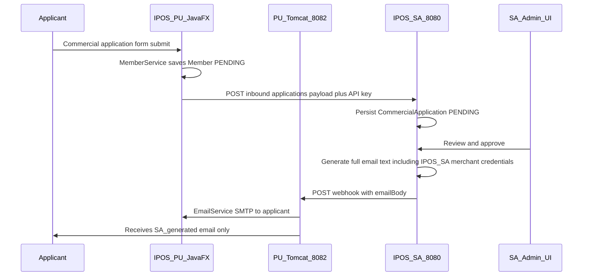

# Build plan — Commercial membership (IPOS-SA ↔ IPOS-PU)

**Purpose:** Implementation guide for **§3a** — PU → SA commercial membership application, SA review/approve, SA-generated notification email (including IPOS-SA merchant credentials), PU SMTP delivery only.

**Companion docs:** [`IPOS_PU_integration.md`](IPOS_PU_integration.md) (REST contract, headers, webhook JSON).

**Note:** IPOS-PU snapshot in this repo lives under [`tempdir_ipos_pu/IPOS/`](tempdir_ipos_pu/IPOS/). Everything else is IPOS-SA.

---

## Implementation todos (tracking)

Use this list when implementing; check items off in your PR or locally.

- [ ] **PU — payload mapping:** In `IposSaService` (backend only): build `payload` JSON from existing `Member` fields; synthesize SA §2.5 keys without UI changes.
- [ ] **SA — approve email + credentials:** Ensure approve flow produces `emailBody` that includes IPOS-SA merchant credentials; extend `approve()` to create merchant `User`/`MerchantProfile` if required (see `CommercialApplicationService` + `MerchantAccountService`).
- [ ] **PU — inbound HTTP:** Replace `IposSaService` mock with `POST` to SA `/api/integration-pu/inbound/applications`; handle 409/503/401; optional `callbackUrl` to PU webhook.
- [ ] **PU — webhook:** `POST` handler; validate `Authorization: Bearer` if configured; on `APPROVED` send SA `emailBody` to applicant via `EmailService` only; optional minimal `Member` updates if PU portal needs them.
- [ ] **PU — rejection:** On `REJECTED`, email `rejectionReason`; update `Member` status per policy.
- [ ] **PU — EmailService:** Replace hardcoded `setFrom` with `spring.mail.username` (or property).
- [ ] **SA — config:** Set `ipos.integration-pu.inbound-api-key`, `webhook-url`, optional `webhook-api-key` in `application.properties`.
- [ ] **Optional:** Add `tempdir_ipos_pu/IPOS/INTEGRATION_COMMERCIAL_SA_PU.md` (mapping table + failure matrix) for operators.

---

## Repository roles (authoritative)

| Codebase | Location in this repository |
|----------|-----------------------------|
| **IPOS-SA (your system)** | **Everything except** [`tempdir_ipos_pu/`](tempdir_ipos_pu/) — e.g. [`backend/`](backend/), [`frontend/`](frontend/), [`IPOS_PU_integration.md`](IPOS_PU_integration.md) at repo root |
| **IPOS-PU (partner snapshot)** | **[`tempdir_ipos_pu/IPOS/`](tempdir_ipos_pu/IPOS/)** only |

**Explicitly out of scope for this plan:** IPOS-CA, [`IposCaService`](tempdir_ipos_pu/IPOS/src/main/java/com/ipos/pu/service/IposCaService.java), stock, online-sale, wholesale orders, SA [`OrderController`](backend/src/main/java/com/ipos/controller/OrderController.java) / [`ProductController`](backend/src/main/java/com/ipos/controller/ProductController.java) for this integration.

### Constraints (stakeholder rules)

| Rule | Implication |
|------|-------------|
| **IPOS-PU JavaFX UI unchanged** | Do **not** edit FXML, styles, or [`RegisterCommercialController`](tempdir_ipos_pu/IPOS/src/main/java/com/ipos/pu/ui/controller/RegisterCommercialController.java) (or other UI controllers) for this integration. The **commercial application form** stays as-is. |
| **IPOS-PU: allowed changes** | **Backend only:** new REST endpoint(s) for SA webhook; implement [`IposSaService`](tempdir_ipos_pu/IPOS/src/main/java/com/ipos/pu/service/IposSaService.java); [`MemberService`](tempdir_ipos_pu/IPOS/src/main/java/com/ipos/pu/service/MemberService.java) / entity / repository as needed for submit + activation; [`application.properties`](tempdir_ipos_pu/IPOS/src/main/resources/application.properties); [`SecurityConfig`](tempdir_ipos_pu/IPOS/src/main/java/com/ipos/pu/config/SecurityConfig.java) for webhook protection; [`EmailService`](tempdir_ipos_pu/IPOS/src/main/java/com/ipos/pu/service/EmailService.java) From-address fix. **No** new user-visible form fields. |
| **Prefer IPOS-SA when choosing** | If something can be solved by **config or code on SA** vs extra complexity on PU, **change SA** (e.g. webhook defaults, approval email generation tolerances, operator docs, [`application.properties`](backend/src/main/resources/application.properties) keys). |

---

## Requirements traceability — §3a PU ↔ SA (source of truth for this build)

| Step | Owner | What happens |
|------|--------|----------------|
| **Trigger** | PU | User applies for **commercial (merchant) membership** using the **existing** IPOS-PU application form (UI unchanged). |
| **PU → SA** | PU → SA | PU sends to SA the **application data** equivalent to that form (JSON `payload` + `externalReferenceId` + optional `callbackUrl`), via `POST /api/integration-pu/inbound/applications` and `X-IPOS-Integration-Key`. |
| **Review** | SA | InfoPharma staff review and run diligence **inside IPOS-SA** (existing admin screens / APIs). |
| **Approve** | SA | On approval, **IPOS-SA is solely responsible for generating** the **full notification email content**, including **IPOS-SA (merchant) login credentials** as required by the brief. That text is stored as `generatedEmailBody` and sent to PU in the webhook JSON field **`emailBody`**. |
| **Deliver** | PU | **IPOS-PU does not author that email.** It **only sends** the SA-generated text using **PU’s email service (SMTP)** — [`EmailService`](tempdir_ipos_pu/IPOS/src/main/java/com/ipos/pu/service/EmailService.java) — to the applicant’s address (from PU `Member.email`, resolved via `externalReferenceId`). |
| **Reject** | SA → PU | SA generates/sends `rejectionReason`; PU relays by email the same way if product requires applicant notification. |

**Boundary (non-negotiable for implementation):** **Generation** = SA. **Transport (SMTP)** = PU. Do not put IPOS-SA username/password generation logic in PU.

---

## Audit — IPOS-PU codebase (Pass 2 deep read)

Findings that **extend** the original plan:

### Member lifecycle (commercial)

- [`Member`](tempdir_ipos_pu/IPOS/src/main/java/com/ipos/pu/model/Member.java): commercial rows use **`password` = ""**, **`status` = PENDING**, no `firstName`/`lastName` set.
- [`MemberService.login`](tempdir_ipos_pu/IPOS/src/main/java/com/ipos/pu/service/MemberService.java) **rejects PENDING** — applicants cannot log in to **PU** until approved.
- **Aligned with §3a:** The **notification email body** that includes **IPOS-SA merchant credentials** is **generated only on SA** and delivered to PU as **`emailBody`**. PU’s job is to **send that string** via SMTP. **Creating the SA merchant user and embedding SA login details in the text** is **SA implementation work** (e.g. extend [`CommercialApplicationService.approve`](backend/src/main/java/com/ipos/service/CommercialApplicationService.java) to call [`MerchantAccountService`](backend/src/main/java/com/ipos/service/MerchantAccountService.java) or equivalent, then append credentials to `generatedEmailBody`). **Do not** generate SA credentials in PU.
- **Optional PU-only follow-up:** If applicants must also use the **PU** portal after approval, add a **separate** product decision (e.g. activate PU `Member` in backend without putting PU credentials in the same email as §3a). Not required for §3a minimum.

### Payload shape vs SA email generator

- SA [`buildApprovalEmailBody`](backend/src/main/java/com/ipos/service/CommercialApplicationService.java) reads JSON string fields: `companyName`, `contactName`, `contactEmail`, `phone` variants, `summary` (see [`IPOS_PU_integration.md`](IPOS_PU_integration.md) §2.5).
- PU **form / Member** has: `email`, `companyRegistrationNumber`, `directorDetails`, `businessType`, `address` — **no `companyName`**, **no `contactPhone`**.
- [`CommercialApplication.jsx`](frontend/src/CommercialApplication.jsx) demo payload uses `companyName`, `contactName`, `contactEmail`, `contactPhone`, `summary`.
- **Resolution (no UI changes):** Implement a **deterministic mapping** only in **backend** [`IposSaService`](tempdir_ipos_pu/IPOS/src/main/java/com/ipos/pu/service/IposSaService.java) (or a small helper), e.g.:
  - `contactEmail` ← `member.getEmail()`
  - `contactName` ← `directorDetails` (trimmed) or first line
  - `companyName` ← synthesize from `companyRegistrationNumber` / `businessType` (no new form field)
  - `summary` ← multiline: businessType + address + Companies House number
  - `contactPhone` ← omit or `""`
  - If SA’s approval letter still needs richer data, **prefer** adjusting [`buildApprovalEmailBody`](backend/src/main/java/com/ipos/service/CommercialApplicationService.java) on **IPOS-SA** rather than changing PU forms.

### Duplicate paths (UI vs REST)

- JavaFX: [`RegisterCommercialController`](tempdir_ipos_pu/IPOS/src/main/java/com/ipos/pu/ui/controller/RegisterCommercialController.java) → [`MemberService.registerCommercial`](tempdir_ipos_pu/IPOS/src/main/java/com/ipos/pu/service/MemberService.java).
- REST: [`MemberController`](tempdir_ipos_pu/IPOS/src/main/java/com/ipos/pu/controller/MemberController.java) `POST /api/members/register/commercial` with [`CommercialRegistrationRequest`](tempdir_ipos_pu/IPOS/src/main/java/com/ipos/pu/dto/CommercialRegistrationRequest.java) — **same service method**. Any HTTP implementation must keep **one** code path.

### Failure / consistency

- Today: **save Member**, then **`IposSaService` mock**. If SA POST **fails** after save, PU has **PENDING member** with no SA row — define behaviour: **retry button**, admin cleanup, or **transactional compensation** (delete member on non-201). Document in implementation.

- **409 Conflict** (duplicate `externalReferenceId`): use **immutable id** after first successful SA submit; store optional **`saApplicationId`** on `Member` (new column) to avoid double-submit bugs.

### Webhook → resolve member

- SA sends `externalReferenceId` (plan: `PU-MEMBER-{id}`) — parse `Long` id and [`MemberRepository.findById`](tempdir_ipos_pu/IPOS/src/main/java/com/ipos/pu/repository/MemberRepository.java) (add `findById` already via JPA).
- Validate `member.getEmail()` matches expectation if needed.

### Email delivery

- [`EmailService`](tempdir_ipos_pu/IPOS/src/main/java/com/ipos/pu/service/EmailService.java): logs to [`EmailLog`](tempdir_ipos_pu/IPOS/src/main/java/com/ipos/pu/model/EmailLog.java); **`setFrom` is hardcoded** to `seyer.city@gmail.com` — should align with `spring.mail.username` to avoid provider rejection.
- Subject lines: define for approval vs rejection (not specified by SA webhook JSON).

### Security

- PU [`SecurityConfig`](tempdir_ipos_pu/IPOS/src/main/java/com/ipos/pu/config/SecurityConfig.java): **permitAll + CSRF off** — new webhook must **validate** `Authorization: Bearer` when [`ipos.integration-pu.webhook-api-key`](backend/src/main/resources/application.properties) is set on SA.

### Out of scope reminder

- [`OrderService.placeOrder`](tempdir_ipos_pu/IPOS/src/main/java/com/ipos/pu/service/OrderService.java) → [`IposCaService`](tempdir_ipos_pu/IPOS/src/main/java/com/ipos/pu/service/IposCaService.java) is **unchanged** by this plan.

---

## Business flow (end-to-end)

---

## Form data → SA payload (PU)

Same fields as [`RegisterCommercialController`](tempdir_ipos_pu/IPOS/src/main/java/com/ipos/pu/ui/controller/RegisterCommercialController.java) / [`CommercialRegistrationRequest`](tempdir_ipos_pu/IPOS/src/main/java/com/ipos/pu/dto/CommercialRegistrationRequest.java).

**Stable `externalReferenceId`:** e.g. `PU-MEMBER-{member.id}` **after** first persist.

**Optional `callbackUrl`:** full URL to PU webhook (config: public base + path).

---

## IPOS-SA — integration surface (already largely implemented)

| Piece | Purpose |
|-------|---------|
| [`POST /api/integration-pu/inbound/applications`](backend/src/main/java/com/ipos/controller/IntegrationPuController.java) | PU submits application; header `X-IPOS-Integration-Key` |
| Admin GET/POST under `/api/integration-pu/applications/**` | ADMIN session + CSRF for approve/reject |
| [`CommercialApplicationService`](backend/src/main/java/com/ipos/service/CommercialApplicationService.java) | On approve: build **`generatedEmailBody`** (must include **§3a IPOS-SA merchant credentials** per product — implement on SA), then [`notifyPu`](backend/src/main/java/com/ipos/service/CommercialApplicationService.java) sends it as JSON **`emailBody`** |
| [`SecurityConfig`](backend/src/main/java/com/ipos/security/SecurityConfig.java) + [`IntegrationPuInboundApiKeyFilter`](backend/src/main/java/com/ipos/security/IntegrationPuInboundApiKeyFilter.java) | Inbound CSRF-exempt + API key |

Webhook JSON shape (SA → PU): `internalId`, `externalReferenceId`, `status` (`APPROVED` \| `REJECTED`), `emailBody` or `rejectionReason` per [`IPOS_PU_integration.md`](IPOS_PU_integration.md) §2.4.

---

## IPOS-PU — work remaining (summary)

**UI tier:** unchanged (see Constraints).

| Area | Action |
|------|--------|
| Inbound HTTP | Replace mock in [`IposSaService`](tempdir_ipos_pu/IPOS/src/main/java/com/ipos/pu/service/IposSaService.java); config properties; error handling |
| Payload | Map `Member` → SA-friendly JSON in **backend only** (see Audit) |
| Webhook | **New** `@RestController` POST handler; Bearer validation; **send `emailBody` to applicant** via [`EmailService`](tempdir_ipos_pu/IPOS/src/main/java/com/ipos/pu/service/EmailService.java) (no content generation on PU) |
| Rejection | Email + set `MemberStatus.INACTIVE` (or policy) — **service layer** |
| EmailService | Config-driven From address |
| Optional schema | Add `saApplicationId` to `Member` only if correlation cannot use `externalReferenceId` alone — **minimize**; prefer SA holding authoritative ids |

## IPOS-SA — preferred place for tradeoffs

| Situation | Prefer SA change |
|-----------|-------------------|
| Default webhook URL, keys, operator docs | [`application.properties`](backend/src/main/resources/application.properties) + [`IPOS_PU_integration.md`](IPOS_PU_integration.md) |
| Full email including **IPOS-SA merchant credentials** | **SA only:** extend approve flow (e.g. create merchant account, append credentials to `generatedEmailBody`) — [`CommercialApplicationService`](backend/src/main/java/com/ipos/service/CommercialApplicationService.java) + existing merchant APIs |
| Approval letter text from PU payload fields | Tune [`buildApprovalEmailBody`](backend/src/main/java/com/ipos/service/CommercialApplicationService.java) or admin override in SA UI |
| Stricter validation of inbound payload | SA DTO / service validation, not PU forms |

---

## Final verification pass (IPOS-PU + SA spot-check)

Additional items confirmed on a full read; no change to scope — they **complete** the plan so implementation does not miss edge cases.

### IPOS-PU navigation and entry points

- Registration flow: [`register.fxml`](tempdir_ipos_pu/IPOS/src/main/resources/com/ipos/pu/ui/register.fxml) → [`RegisterController`](tempdir_ipos_pu/IPOS/src/main/java/com/ipos/pu/ui/controller/RegisterController.java) → commercial → [`register-commercial.fxml`](tempdir_ipos_pu/IPOS/src/main/resources/com/ipos/pu/ui/register-commercial.fxml) / [`RegisterCommercialController`](tempdir_ipos_pu/IPOS/src/main/java/com/ipos/pu/ui/controller/RegisterCommercialController.java). REST duplicate: [`MemberController`](tempdir_ipos_pu/IPOS/src/main/java/com/ipos/pu/controller/MemberController.java) `POST /api/members/register/commercial`.

### IPOS-SA inbound contract (unchanged)

- [`IntegrationPuInboundApiKeyFilter`](backend/src/main/java/com/ipos/security/IntegrationPuInboundApiKeyFilter.java): header name **`X-IPOS-Integration-Key`**, must **match** configured key; **`POST`** only; URI must **contain** `/api/integration-pu/inbound`.
- Request DTO: [`InboundCommercialApplicationRequest`](backend/src/main/java/com/ipos/dto/InboundCommercialApplicationRequest.java) — `payload` is **`JsonNode`** (object), not a raw string.

### Runtime and networking

- **Webhook direction:** SA → PU (server-to-server). PU must be **up** and listening on **`server.port`** ([`8082`](tempdir_ipos_pu/IPOS/src/main/resources/application.properties)) when an admin **approves** in SA, or webhook shows `FAILED` in SA UI while the decision still saves.
- **Local demo:** `ipos.integration-pu.webhook-url=http://localhost:8082/...` is valid if both processes run on the same machine.
- **`callbackUrl`:** If PU sends a per-request URL, it must be an **absolute** URL (scheme + host + port + path). Consider a PU property such as `ipos.pu.public-base-url` used to build `callbackUrl` for non-local deployments.

### Libraries

- PU already depends on **`spring-boot-starter-web`** — **Jackson** and **`RestTemplate`** / **`RestClient`** (Java 21 + Spring 6) are available for `IposSaService` without new dependencies.

### Post-approval welcome name (backend only)

- [`CatalogueController`](tempdir_ipos_pu/IPOS/src/main/java/com/ipos/pu/ui/controller/CatalogueController.java) reads **`getFirstName()`** — **do not edit** that UI. On webhook **APPROVED**, set **`Member.firstName`** (and optionally `lastName`) in **service/activation logic** from existing stored `directorDetails` or a fixed label so the **existing** welcome label works without any FXML/controller change.

### Explicitly unchanged (other PU features)

- [`IposCaService`](tempdir_ipos_pu/IPOS/src/main/java/com/ipos/pu/service/IposCaService.java), [`OrderService`](tempdir_ipos_pu/IPOS/src/main/java/com/ipos/pu/service/OrderService.java), [`PaymentController`](tempdir_ipos_pu/IPOS/src/main/java/com/ipos/pu/controller/PaymentController.java) `/api/payments/ca-clearance` — **out of scope**; do not modify for commercial-membership integration.

### Tests

- PU only has [`IposPuApplicationTests.contextLoads`](tempdir_ipos_pu/IPOS/src/test/java/com/ipos/pu/IposPuApplicationTests.java). Optional follow-up: **WebMvcTest** for the new webhook controller and/or mocked `IposSaService` HTTP — not required for plan completion.

---

## Optional disposable doc (PU folder)

[`tempdir_ipos_pu/IPOS/INTEGRATION_COMMERCIAL_SA_PU.md`](tempdir_ipos_pu/IPOS/INTEGRATION_COMMERCIAL_SA_PU.md): mapping table, webhook contract, **failure matrix** (401/409/503), local ports SA `8080` / PU `8082`, **startup order** (PU running before approval), **callbackUrl** construction.

---

## Implementation readiness checklist (build order)

1. **SA:** Set `ipos.integration-pu.inbound-api-key` and `webhook-url` (PU webhook URL); optional `webhook-api-key`.
2. **SA:** Implement **approve** path so `generatedEmailBody` contains the **full** applicant-facing text including **IPOS-SA merchant username/password** (wire to [`MerchantAccountService`](backend/src/main/java/com/ipos/service/MerchantAccountService.java) or manual admin paste — product decision; must not be generated in PU).
3. **PU:** Implement [`IposSaService`](tempdir_ipos_pu/IPOS/src/main/java/com/ipos/pu/service/IposSaService.java) POST inbound; map form `Member` → `payload` JSON.
4. **PU:** Implement webhook POST → `EmailService.sendEmail(applicantEmail, subject, emailBody)` with subject line chosen in code or config.
5. **E2E test:** Submit on PU → row in SA → Approve → one email received; body matches SA preview; credentials work on SA login.

---

## Success criteria

- **§3a satisfied:** PU sends application data to SA; SA reviews; on approve, **SA generates** the full email (including **IPOS-SA merchant login credentials** in the text); **PU only sends** that text via its SMTP to the applicant.
- **PU commercial registration UI/FXML unchanged**; PU changes are **backend** (submit + webhook + optional Member updates) only.
- Commercial registration on PU creates a row in SA admin list with readable payload preview.
- After approve, applicant receives **one** email **from PU’s mail server** whose **body** is exactly what SA produced in **`emailBody`** (credentials appear because **SA** put them there).
- Admin **reject** flows per SA/PU policy (webhook `rejectionReason`; PU may email via SMTP).
- Shared API keys configured; webhook authenticated when keys enabled.
- Credential and merchant-account **business logic** lives on **SA** where possible (see tradeoffs table).
