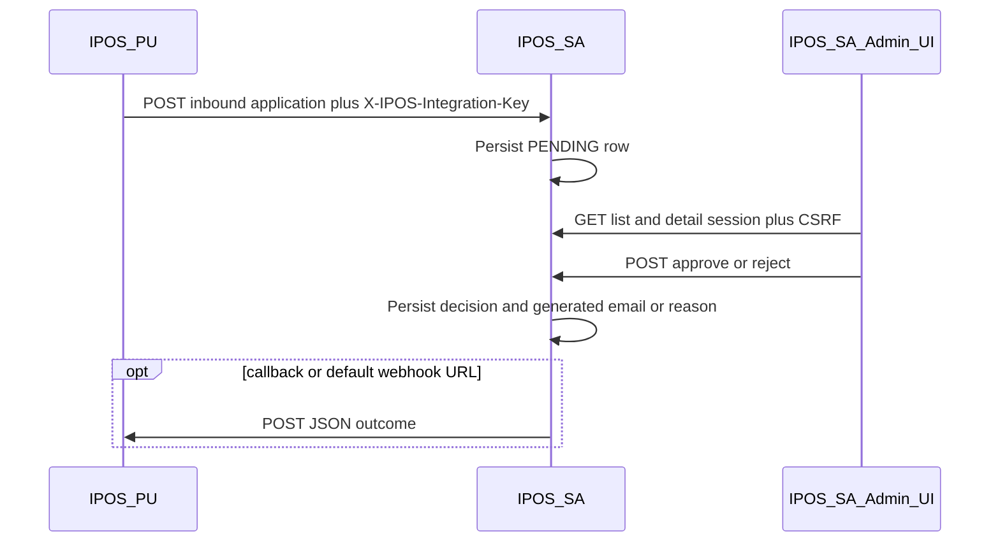

# IPOS-PU ↔ IPOS-SA Integration Guide

**Document purpose:** This document describes what **IPOS-SA** (this repository) implements for the **Commercial Application** integration with **IPOS-PU**, and what **IPOS-PU** must implement or configure so both systems work together reliably.

**Audience:** Developers and operators on both the IPOS-SA and IPOS-PU sides.

**Related implementation (IPOS-SA):**

| Area | Primary locations |
|------|-------------------|
| REST API | `backend/src/main/java/com/ipos/controller/IntegrationPuController.java` |
| Business logic | `backend/src/main/java/com/ipos/service/CommercialApplicationService.java` |
| Persistence | `backend/src/main/java/com/ipos/entity/CommercialApplication.java`, `CommercialApplicationRepository.java` |
| Inbound API key filter | `backend/src/main/java/com/ipos/security/IntegrationPuInboundApiKeyFilter.java` |
| Security rules | `backend/src/main/java/com/ipos/security/SecurityConfig.java` |
| Configuration | `backend/src/main/resources/application.properties` (`ipos.integration-pu.*`) |
| Admin UI | `frontend/src/CommercialApplication.jsx`, `frontend/src/auth/rbac.js`, `frontend/src/api.js` |

---

## 1. High-level architecture

IPOS-PU holds the end-user workflow for **commercial applications**. When an application is ready for InfoPharma review, IPOS-PU **pushes** the application data to IPOS-SA. IPOS-SA stores it, shows it to **ADMIN** users in the **Commercial Application** screen, and records **approve** or **reject** decisions.

Optionally, after a decision, IPOS-SA **POSTs** a JSON notification to a URL on IPOS-PU (per-request **callback URL** or a **default webhook URL** configured on IPOS-SA). IPOS-PU can use that notification to trigger email to the applicant (e.g. send the generated approval body or surface the rejection reason).



**Important:** Inbound traffic from IPOS-PU to IPOS-SA is **server-to-server**. It does **not** use browser sessions or CSRF tokens. Outbound webhooks from IPOS-SA to IPOS-PU are also **server-to-server**.

---

## 2. What IPOS-SA has implemented

### 2.1 Data model

Each submitted application is stored as a **commercial application** row with:

- **Internal id** (`id`): Long, generated by IPOS-SA (used in admin APIs and in webhook JSON as `internalId`).
- **externalReferenceId** (string, unique): Supplied by IPOS-PU; must uniquely identify the application **in IPOS-PU’s domain**. Duplicate submissions with the same value return HTTP **409 Conflict**.
- **status**: `PENDING` → then either `APPROVED` or `REJECTED` (terminal states for that workflow step).
- **payloadJson**: Full JSON payload as received from IPOS-PU (stringified). This is what admins see in the UI.
- **generatedEmailBody**: Filled when **approved** (plain text for IPOS-PU to email).
- **rejectionReason**: Filled when **rejected**.
- **createdAt**, **decidedAt**, **decidedBy** (admin user), **callbackUrl** (optional override for webhooks).

Database table name: `commercial_applications` (managed by Hibernate `ddl-auto` in development).

### 2.2 Inbound API (IPOS-PU → IPOS-SA)

| Item | Value |
|------|--------|
| Method / path | `POST /api/integration-pu/inbound/applications` |
| Base URL | IPOS-SA backend base (e.g. `https://sa.example.com` in production; dev `http://localhost:8080`) |
| Authentication | Header **`X-IPOS-Integration-Key`**: must **exactly match** `ipos.integration-pu.inbound-api-key` on IPOS-SA |
| CSRF | Not used; this path is CSRF-exempt |
| Session | Not required |
| Content-Type | `application/json` |

**Request body (JSON):**

| Field | Required | Description |
|-------|----------|-------------|
| `externalReferenceId` | Yes | Non-blank string; unique per application from IPOS-PU’s perspective |
| `payload` | Yes | JSON **object** (arbitrary keys; see §5 for fields used in email generation) |
| `callbackUrl` | No | If present, IPOS-SA uses this URL for the **outbound webhook** after approve/reject for **this** application; otherwise it uses the global `ipos.integration-pu.webhook-url` if set |

**Success response:** HTTP **201 Created** with body:

```json
{
  "id": 42,
  "externalReferenceId": "PU-2026-001"
}
```

`id` is IPOS-SA’s internal id (store this in IPOS-PU if you need to correlate with SA).

**Error responses:**

| HTTP | Condition | Example body |
|------|-----------|--------------|
| 503 | `ipos.integration-pu.inbound-api-key` is empty on IPOS-SA | JSON `error` explaining inbound is not configured |
| 401 | Missing or wrong `X-IPOS-Integration-Key` | `{"error":"Invalid or missing integration API key."}` |
| 400 | Validation failure (e.g. missing `payload`) | Spring validation / JSON error |
| 409 | Duplicate `externalReferenceId` | `{"error":"Duplicate external reference","externalReferenceId":"..."}` |

### 2.3 Admin APIs (browser session; not for IPOS-PU direct use in production)

These are used by the IPOS-SA React app after **ADMIN** login. They require **session cookie** + **CSRF** (`X-XSRF-TOKEN` header on mutating requests), same as the rest of the SPA.

| Method | Path | Description |
|--------|------|-------------|
| `GET` | `/api/integration-pu/applications` | List applications; optional `?status=PENDING` or `APPROVED` or `REJECTED` |
| `GET` | `/api/integration-pu/applications/{id}` | Full detail including `payloadJson` |
| `POST` | `/api/integration-pu/applications/{id}/approve` | Optional body `{"emailBody":"..."}` to override generated text; otherwise SA generates from payload |
| `POST` | `/api/integration-pu/applications/{id}/reject` | Body `{"reason":"..."}` (required non-blank) |

**Authorization:** `hasRole("ADMIN")` for all `/api/integration-pu/**` **except** the inbound POST above.

**Decision response body** (approve/reject, HTTP 200):

```json
{
  "id": 42,
  "status": "APPROVED",
  "generatedEmailBody": "...",
  "rejectionReason": null,
  "puWebhookStatus": "SENT",
  "puWebhookError": null
}
```

- **puWebhookStatus**: `SKIPPED` (no URL configured), `SENT` (HTTP call succeeded), or `FAILED` (network/HTTP error; decision is still saved).
- **puWebhookError**: Non-null when status is `FAILED` (short error detail).

### 2.4 Outbound webhook (IPOS-SA → IPOS-PU)

When an admin **approves** or **rejects**, IPOS-SA attempts **one** HTTP **POST** to:

1. The application’s **callbackUrl** (if non-blank), else  
2. **`ipos.integration-pu.webhook-url`** from IPOS-SA configuration.

If neither is set, the webhook step is **skipped** (`puWebhookStatus: SKIPPED`). The decision remains persisted.

| Item | Value |
|------|--------|
| Method | `POST` |
| Content-Type | `application/json` |
| Optional auth | If `ipos.integration-pu.webhook-api-key` is set on IPOS-SA, request includes `Authorization: Bearer <token>` |

**JSON body — approval:**

```json
{
  "internalId": 42,
  "externalReferenceId": "PU-2026-001",
  "status": "APPROVED",
  "emailBody": "Dear … (full generated plain text)"
}
```

**JSON body — rejection:**

```json
{
  "internalId": 42,
  "externalReferenceId": "PU-2026-001",
  "status": "REJECTED",
  "rejectionReason": "Text supplied by admin"
}
```

**IPOS-PU responsibilities for the webhook endpoint:**

- Expose an **HTTPS** URL reachable from IPOS-SA (firewall / allowlist as needed).
- Accept `POST` with JSON body as above.
- If using shared secret, validate **`Authorization: Bearer`** against the same value IPOS-SA sets in `ipos.integration-pu.webhook-api-key`.
- Return **2xx** on success so IPOS-SA records `SENT`. Non-2xx or timeouts will yield `FAILED` on the admin response (IPOS-SA does **not** roll back the decision).
- Implement **idempotency** if IPOS-PU might receive duplicate posts (e.g. same `internalId` + `status`); IPOS-SA currently sends a single attempt per decision.

### 2.5 Generated approval email (IPOS-SA)

If the admin does not override `emailBody`, IPOS-SA builds plain text from `payloadJson` by reading **string** fields only (first match in order):

| Concept | Candidate field names (first match wins) |
|---------|------------------------------------------|
| Company | `companyName`, `company`, `organisationName`, `organizationName` |
| Contact name | `contactName`, `applicantName`, `name`, `fullName` |
| Email | `contactEmail`, `email`, `emailAddress` |
| Phone | `contactPhone`, `phone`, `phoneNumber`, `telephone` |
| Summary block | `summary`, `description`, `applicationSummary` |

If IPOS-PU uses different names, either align to these keys **or** rely on admin override via API (future UI could expose override; backend supports optional `emailBody` on approve).

### 2.6 Frontend (IPOS-SA)

- **Route:** `commercialApplication` — label **Commercial Application**.
- **RBAC:** Package `IPOS-SA-PU` — **ADMIN only** (`frontend/src/auth/rbac.js`).
- **Demo mode:** If the list API fails or returns an empty list, the UI shows a **clearly labeled** demo application so workflows can be previewed without live data.

---

## 3. IPOS-SA configuration (operators)

Set in `application.properties` or environment variables (Spring Boot relaxed binding: `IPOS_INTEGRATION_PU_INBOUND_API_KEY` etc.):

| Property | Meaning |
|----------|---------|
| `ipos.integration-pu.inbound-api-key` | Shared secret IPOS-PU must send in `X-IPOS-Integration-Key`. **If empty, inbound POST returns 503.** |
| `ipos.integration-pu.webhook-url` | Default URL on IPOS-PU for outcome notifications when `callbackUrl` is not sent on inbound. |
| `ipos.integration-pu.webhook-api-key` | Optional bearer token IPOS-SA sends on outbound webhook POSTs. |

**Production checklist:** Use strong random keys; restrict network access; use HTTPS; rotate keys with coordination between teams.

---

## 4. What IPOS-PU must implement or change

### 4.1 Submit applications to IPOS-SA

1. **After** a commercial application exists in IPOS-PU (or when it transitions to “submitted for InfoPharma review”), call:

   `POST {IPOS_SA_BASE_URL}/api/integration-pu/inbound/applications`

2. **Headers:**

   - `Content-Type: application/json`
   - `X-IPOS-Integration-Key: <same value as IPOS-SA’s ipos.integration-pu.inbound-api-key>`

3. **Body:**

   - `externalReferenceId`: Stable unique id from IPOS-PU (e.g. primary key or business reference). **Do not reuse** for a different application.
   - `payload`: JSON object containing at least the fields you want admins to see; include the fields in §2.5 if you want the default approval email to be rich.
   - `callbackUrl` (optional): Your webhook URL for **this** application’s outcome (overrides SA default).

4. **Store** the returned `id` (IPOS-SA internal id) if you need to correlate webhook payloads with local records.

5. **Handle 409:** Treat as duplicate submission; update local state or skip resend depending on product rules.

6. **Handle 503:** Inbound disabled on SA side; retry later or alert operations.

### 4.2 Receive decisions (webhook)

1. Implement a **POST** endpoint (path of your choice) matching §2.4.
2. Configure IPOS-SA with either:
   - Per-submission `callbackUrl`, or  
   - Global `ipos.integration-pu.webhook-url` pointing to your endpoint.
3. Set `ipos.integration-pu.webhook-api-key` on IPOS-SA to a secret and validate `Authorization: Bearer` on IPOS-PU.
4. On **`APPROVED`:** Use `emailBody` as the body of the email to the applicant (or merge into your templates).
5. On **`REJECTED`:** Use `rejectionReason` for user-visible messaging or internal workflow.
6. Respond with **HTTP 2xx** quickly; offload heavy work to async jobs if needed.

### 4.3 Optional: polling / admin APIs

IPOS-PU does **not** need to call the session-based admin GET APIs for normal operation if webhooks are reliable. If you add **polling** as a backup, you would need a machine-to-machine auth story (not implemented as a separate API key for admin routes in this codebase); the typical pattern is **webhook-first** as implemented.

### 4.4 Network and TLS

- IPOS-PU must allow **outbound** HTTPS to IPOS-SA.
- IPOS-SA must allow **outbound** HTTPS to IPOS-PU’s webhook URL.
- Use certificates valid for both environments; align DNS and firewall rules.

### 4.5 Idempotency and retries

- IPOS-SA sends **one** webhook attempt per decision. If it fails, IPOS-PU may need a **support process** or future **polling API** to reconcile.
- IPOS-PU should treat duplicate webhook deliveries defensively (same `internalId` + `status`).

---

## 5. Recommended `payload` shape (for best default email)

Not strictly required, but recommended for the built-in approval letter:

```json
{
  "companyName": "Example Pharmacy Ltd",
  "contactName": "Jane Smith",
  "contactEmail": "jane@example.com",
  "contactPhone": "+44 20 7946 0958",
  "summary": "Short narrative of the commercial application."
}
```

You may add extra fields for display in IPOS-SA; they are stored in `payloadJson` and shown to admins in full.

---

## 6. Security summary

| Flow | Mechanism |
|------|-----------|
| PU → SA inbound | Shared secret header `X-IPOS-Integration-Key` |
| SA admin UI → SA | Session cookie + CSRF |
| SA → PU webhook | Optional `Authorization: Bearer` + HTTPS (recommended) |

---

## 7. Testing (integration)

**IPOS-PU developers:**

1. Obtain a test `inbound-api-key` and SA base URL from the IPOS-SA team.
2. Send a test `POST` with `curl` or Postman; expect `201` and an `id`.
3. Log in to IPOS-SA as **admin**, open **Commercial Application**, approve or reject.
4. Verify webhook hits your dev endpoint with the expected JSON.

**Example `curl` (inbound):**

```bash
curl -sS -X POST "http://localhost:8080/api/integration-pu/inbound/applications" \
  -H "Content-Type: application/json" \
  -H "X-IPOS-Integration-Key: YOUR_SHARED_SECRET" \
  -d "{\"externalReferenceId\":\"TEST-001\",\"payload\":{\"companyName\":\"Test Co\",\"contactName\":\"Ada\",\"contactEmail\":\"ada@example.com\"}}"
```

---

## 8. Troubleshooting

| Symptom | Likely cause |
|---------|----------------|
| Inbound always 503 | `ipos.integration-pu.inbound-api-key` not set on IPOS-SA |
| Inbound 401 | Wrong or missing `X-IPOS-Integration-Key` |
| Inbound 409 | Duplicate `externalReferenceId` |
| Webhook always SKIPPED | No `callbackUrl` on request and no `webhook-url` on SA |
| Webhook FAILED | IPOS-PU URL unreachable, TLS error, non-2xx, or timeout |
| Approval email is generic | Payload missing string fields in §2.5; add fields or use approve override |

---

## 9. Version and scope

This document reflects the **IPOS-SA** implementation in the repository containing this file: **IntegrationPuController**, **CommercialApplicationService**, **IntegrationPuInboundApiKeyFilter**, and related **DTOs/entity**. Optional future items (e.g. dedicated polling APIs, idempotency keys on inbound) are **not** part of the current codebase unless added later.

For questions about **IPOS-PU**-specific behavior, refer to the IPOS-PU project documentation and align with this contract.
